<p align = "center" draggable="false" >
</p>

## <h1 align="center" id="heading">Session 15: Build & Serve an A2A Endpoint for Our LangGraph Agent</h1>

| 🤓 Pre-work | 📰 Session Sheet | ⏺️ Recording     | 🖼️ Slides        | 👨‍💻 Repo         | 📝 Homework      | 📁 Feedback       |
|:-----------------|:-----------------|:-----------------|:-----------------|:-----------------|:-----------------|:-----------------|
| [Session 15: Pre-Work](https://www.notion.so/Session-15-Agent2Agent-Protocol-Agent-Ops-247cd547af3d8066bc5be493bc0c7eda?source=copy_link#247cd547af3d81369191e4e6cd62f875)| [Session 15: Agent2Agent Protocol & Agent Ops](https://www.notion.so/Session-15-Agent2Agent-Protocol-Agent-Ops-247cd547af3d8066bc5be493bc0c7eda) | Coming soon! | Coming soon! | You are here! |Coming soon! | Coming soon!

# A2A Protocol Implementation with LangGraph

This session focuses on implementing the **A2A (Agent-to-Agent) Protocol** using LangGraph, featuring intelligent helpfulness evaluation and multi-turn conversation capabilities.

## 🎯 Learning Objectives

By the end of this session, you'll understand:

- **🔄 A2A Protocol**: How agents communicate and evaluate response quality

## 🧠 A2A Protocol with Helpfulness Loop

The core learning focus is this intelligent evaluation cycle:

```mermaid
graph TD
    A["👤 User Query"] --> B["🤖 Agent Node<br/>(LLM + Tools)"]
    B --> C{"🔍 Tool Calls<br/>Needed?"}
    C -->|"Yes"| D["⚡ Action Node<br/>(Tool Execution)"]
    C -->|"No"| E["🎯 Helpfulness Node<br/>(A2A Evaluation)"]
    D --> F["🔧 Execute Tools"]
    F --> G["📊 Tavily Search<br/>(Web Results)"]
    F --> H["📚 ArXiv Search<br/>(Academic Papers)"]  
    F --> I["📄 RAG Retrieval<br/>(Document Search)"]
    G --> B
    H --> B
    I --> B
    E --> J{"✅ Is Response<br/>Helpful?"}
    J -->|"Yes (Y)"| K["🏁 END<br/>(Task Complete)"]
    J -->|"No (N)"| L{"🔄 Loop Count<br/>< 10?"}
    L -->|"Yes"| B
    L -->|"No"| K
    
    style A fill:#1e3a5f,stroke:#ffffff,stroke-width:3px,color:#ffffff
    style B fill:#4a148c,stroke:#ffffff,stroke-width:3px,color:#ffffff
    style C fill:#0d47a1,stroke:#ffffff,stroke-width:3px,color:#ffffff
    style D fill:#1b5e20,stroke:#ffffff,stroke-width:3px,color:#ffffff
    style E fill:#e65100,stroke:#ffffff,stroke-width:3px,color:#ffffff
    style F fill:#2e7d32,stroke:#ffffff,stroke-width:3px,color:#ffffff
    style G fill:#00695c,stroke:#ffffff,stroke-width:3px,color:#ffffff
    style H fill:#4527a0,stroke:#ffffff,stroke-width:3px,color:#ffffff
    style I fill:#283593,stroke:#ffffff,stroke-width:3px,color:#ffffff
    style J fill:#2e7d32,stroke:#ffffff,stroke-width:3px,color:#ffffff
    style K fill:#c62828,stroke:#ffffff,stroke-width:3px,color:#ffffff
    style L fill:#f57c00,stroke:#ffffff,stroke-width:3px,color:#ffffff
```



# Build 🏗️

Complete the following tasks to understand A2A protocol implementation:

## 🚀 Quick Start

```bash
# Setup and run
./quickstart.sh
```

```bash
# Start LangGraph server
uv run python -m app
```

```bash
# Test the A2A Serer
uv run python app/test_client.py
```

### 🏗️ Activity #1:

Build a LangGraph Graph to "use" your application.

Do this by creating a Simple Agent that can make API calls to the 🤖Agent Node above through the A2A protocol. 

### ❓ Question #1:

What are the core components of an `AgentCard`?

### ✅ Answer #1:

The `AgentCard` is defined in lines 71-79 of app/__main__.py   
Main components for our agents are: name, description, url, version, default_input_modes, default_output_modes, capabilities, and skills.     

```python
AgentCard(
    name='General Purpose Agent',                    # Agent name
    description='A helpful AI assistant...',         # Agent description
    url=f'http://{host}:{port}/',                   # Agent endpoint URL
    version='1.0.0',                                # Agent version
    default_input_modes=Agent.SUPPORTED_CONTENT_TYPES,  # Supported input formats
    default_output_modes=Agent.SUPPORTED_CONTENT_TYPES, # Supported output formats
    capabilities=capabilities,                       # AgentCapabilities object
    skills=skills,                                  # List of AgentSkill objects
)
```
To see what is the general definition of the `AgentCard` class:  
`python -c "from a2a.types import AgentCard; import inspect; print(inspect.getsource(AgentCard))"`    

*    capabilities: AgentCapabilities  
*    default_output_modes: list[str]  
*    description: str = Field( ..., examples-['Agent that does this and that'])
*    documentation_url: str | None = None  
*    icon_url: str | None = None  
*    name: str = Field(..., examples=['Recipe Agent'])  
*    preferred_transport: str | None = Field(  default='JSONRPC', examples=['JSONRPC', 'GRPC', 'HTTP+JSON']  )  
*    protocol_version: str | None = '0.3.0'  
*    provider: AgentProvider | None = None   #service provider
*    security: list[dict[str, list[str]]] | None = Field( default=None,  examples=[[{'oauth': ['read']}, {'api-key': [], 'mtls': []}]], )  
*    security_schemes: dict[str, SecurityScheme] | None = None  
*    signatures: list[AgentCardSignature] | None = None  #JSON Web Signatures computed for this AgentCard.  
*    supports_authenticated_extended_card: bool | None = None  
*    url: str = Field(..., examples=['https://api.example.com/a2a/v1'])  
*    version: str = Field(..., examples=['1.0.0'])  

### ❓ Question #2:

Why is A2A (and other such protocols) important in your own words?  

### ✅ Answer #2:  
The A2A protocol provides methods to expand an isolated AI system into a networked ecosystem of specialized agents that can work together to solve problems.   
New agents can be added for various specialized tasks. It reminds me of a network of doctors, PAs, and nurses in a hospital.

### A2A PROTOCOL IMPACT
1. #### Interoperability & Standardization  
    * A2A protocols create a **_common language_** for AI agents to communicate
2. #### Composable (modular) e.g.:
    * Doc analysis: RAG agent
    * Web search: Tavily agent
3. #### Security + Trust between agents defined in AgentCard:
    * Authentication
    * Authorization
    * Security
4. #### Scalability & Distribution
    Via the protocol agents run on different: 
    * servers
    * cloud providers
    * different organizations
5. #### Discoverability & Self-Description  
    * Via the AgentCard, agents can describe themselves and be discoverable (when looking whom to add in the system)
6. #### Practical Scenarios: e.g.:
    * Research Agent 
    * Helpulness evaluator 
    * Multi-agent workflows

>------------------------------------------------------------------------------------------------------------------------------

### 🚧 Advanced Build:
✅ <mark>Please see extra answers in app/app_README.md<m/mark>

<details>
<summary>🚧 Advanced Build 🚧 (OPTIONAL - <i>open this section for the requirements</i>)</summary>

Use a different Agent Framework to **test** your application.

Do this by creating a Simple Agent that acts as different personas with different goals and have that Agent use your Agent through A2A. 

Example:

"You are an expert in Machine Learning, and you want to learn about what makes Kimi K2 so incredible. You are not satisfied with surface level answers, and you wish to have sources you can read to verify information."
</details>

## 📁 Implementation Details

For detailed technical documentation, file structure, and implementation guides, see:

**➡️ [app/app_README.md](./app/app_README.md)**

This contains:
- Complete file structure breakdown
- Technical implementation details
- Tool configuration guides
- Troubleshooting instructions
- Advanced customization options

# Ship 🚢

- Short demo showing running Client

# Share 🚀

- Explain the A2A protocol implementation
✅ We use the a2a python library which implements a standardized way for AI agents to communicate with each other. 
The A2A protocol defines:
Agent Cards: Standardized descriptions of what agents can do
Message Formats: How agents send requests and responses
Task Management: How to track conversation state
Event Streaming: How to handle real-time updates

A2A Protocol Implementation Locations:
* __main__.py: Server setup and agent card definition
* agent_executor.py: Core A2A protocol executor
    * Lines 20-94: A2A Protocol Implementation
* test_client.py: A2A client and discovery
    * Lines 25-35: A2A Protocol Discovery
    * Lines 40-60: A2A Standardized Communication
* agent.py: A2A-compatible streaming interface* agent_executor.py: Core A2A protocol executor
    * Lines 58-190: A2A-Compatible Streaming

- Share 3 lessons learned about agent evaluation
1. How to use two agents (although I reverted to the internal helpful agent becase of loop costs )
2. How sensitive the helpful agent can be to its prompt.
3. How FastAPI is used via Starlette (FastAPI's foundation), which creates a FastAPI-compatible HTTP server that implements the A2A protocol endpoints, and uvicorn runs it just like it would run a FastAPI application.

- Discuss 3 lessons not learned (areas for improvement)
1. Difficulty in understanding the whole codebase without AI's help (e.g. how FastAPI is used)
2. When it is overkill to use A2A.
3. How to make sure that the generated answers are appropriate for the user to learn abut the topic, rather than how to answer the question.
4. How to scale it up
5. How to simplify the codebase when some of it is not needed.

# Submitting Your Homework

## Main Homework Assignment

Follow these steps to prepare and submit your homework assignment:
1. Create a branch of your `AIE7` repo to track your changes. Example command: `git checkout -b s15-assignment`
2. Complete the activity above
3. Answer the questions above _in-line in this README.md file_
4. Record a Loom video reviewing the changes you made for this assignment and your comparison of the flows (Breakout Room Part #2 - Task 3).
5. Commit, and push your changes to your `origin` repository. _NOTE: Do not merge it into your main branch._
6. Make sure to include all of the following on your Homework Submission Form:
    + The GitHub URL to the `15_A2A_LANGGRAPH` folder _on your assignment branch (not main)_
    + The URL to your Loom Video
    + Your Three lessons learned/not yet learned
    + The URLs to any social media posts (LinkedIn, X, Discord, etc.) ⬅️ _easy Extra Credit points!_

### OPTIONAL: Advanced Build Assignment _(Can be done in lieu of the Main Homework Assignnment)_

Follow these steps to prepare and submit your homework assignment:
1. Create a branch of your `AIE7` repo to track your changes. Example command: `git checkout -b s015-assignment`
2. Complete the requirements for the Advanced Build
3. Record a Loom video reviewing the agent you built and demostrating in action
4. Commit, and push your changes to your `origin` repository. _NOTE: Do not merge it into your main branch._
5. Make sure to include all of the following on your Homework Submission Form:
    + The GitHub URL to the `15_A2A_LANGGRAPH` folder _on your assignment branch (not main)_
    + The URL to your Loom Video
    + Your Three lessons learned/not yet learned
    + The URLs to any social media posts (LinkedIn, X, Discord, etc.) ⬅️ _easy Extra Credit points!_
=======
