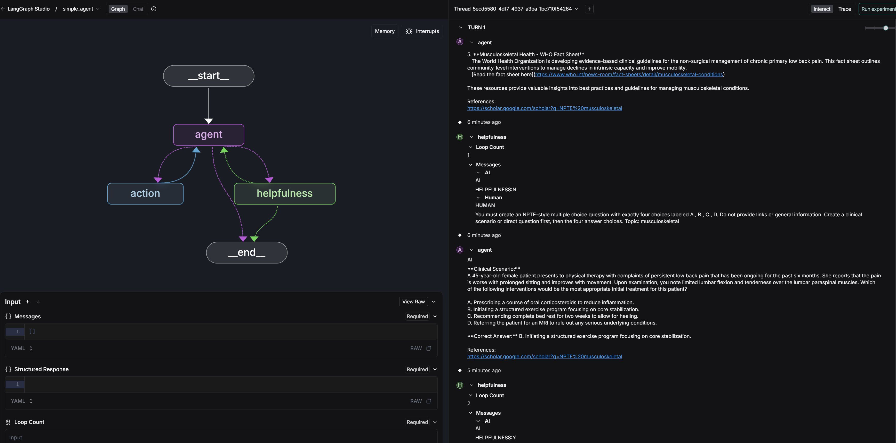

# 🤖 LangGraph Agent Implementation

This directory contains the complete implementation of a LangGraph agent with A2A protocol and helpfulness evaluation. This README provides detailed technical documentation for understanding and extending the codebase.

## 📁 File Structure

```
📦 app/
├── 📄 __init__.py                           # Package initialization
├── 📄 __main__.py                           # Entry point for A2A server
├── 📄 agent.py                              # Core agent implementation with ResponseFormat
├── 📄 agent_executor.py                     # A2A protocol executor and server setup
├── 📄 agent_graph_with_helpfulness.py      # LangGraph with helpfulness evaluation
├── 📄 rag.py                                # RAG implementation with Qdrant vectorstore
├── 📄 tools.py                              # Tool belt configuration (Tavily, ArXiv, RAG)
├── 📄 test_client.py                        # Test client for the agent API
└── 📄 README.md                             # This file
```
✅ In this code I modifies the scope:
The purpose of my app is to provide to the user a multiple-choice QAs exactly in the format of NPTE (National Physical THerapy Examination) board exams.
The user inputs a topic of the 14 available NPTE topics, and the agent searches with the tools to find materials to compose the multiple choise QAs.
The helpfulness agent checks for validity, format, and relavancy and responds with Y or N. The rest of the flow is same as in the example graph.

This is the response in langgraph studio, with input: "musculoskeletal". It is exactly as expected.




## 🔧 Core Components

### 1. `agent_graph_with_helpfulness.py`

**Purpose**: Implements the main LangGraph with helpfulness evaluation loop.

**Key Components**:
- `AgentState`: TypedDict defining the state schema with message history
- `build_model_with_tools()`: Binds tools to the language model
- `call_model()`: Main agent node that processes messages and generates responses
- `route_to_action_or_helpfulness()`: Router deciding between tool execution and evaluation
- `helpfulness_node()`: A2A evaluation node that assesses response quality
- `helpfulness_decision()`: Decision node for continuing or terminating the loop

**Graph Structure**:
```python
graph.add_node("agent", _call_model)           # Main LLM + tools
graph.add_node("action", tool_node)            # Tool execution
graph.add_node("helpfulness", _helpfulness_node)  # A2A evaluation
```

**Flow Logic**:
1. Start at `agent` node
2. If tool calls needed → `action` node → back to `agent`
3. If no tool calls → `helpfulness` node
4. Helpfulness evaluation: Y (end) or N (continue, max 10 loops)

### 2. `agent.py`

**Purpose**: Defines the main Agent class with streaming capabilities and response formatting.

**Key Features**:
- `ResponseFormat`: Pydantic model for structured responses
- OpenAI model integration
- Streaming interface with real-time updates
- A2A protocol compliance with status tracking

**Response States**:
- `input_required`: User needs to provide more information
- `completed`: Request successfully fulfilled
- `error`: Error occurred during processing

### 3. `tools.py`

**Purpose**: Assembles the tool belt available to agents.

**Available Tools**:
```python
    def get_tool_belt() -> List:
        """Return the list of tools available to agents (Tavily, Arxiv, RAG, Google Scholar, IJSPT)."""
        tavily_tool = TavilySearchResults(max_results=5)
        return [
            tavily_tool, 
            ArxivQueryRun(), 
            retrieve_information,
            google_scholar_search,
            ijspt_search
        ]
```

### 4. `rag.py`

**Purpose**: Complete RAG (Retrieval-Augmented Generation) implementation.

**Architecture**:
- **Document Loading**: Recursively loads PDFs from `RAG_DATA_DIR`
- **Text Splitting**: Token-aware chunking with `RecursiveCharacterTextSplitter`
- **Embeddings**: OpenAI embeddings for vector representation
- **Vector Store**: In-memory Qdrant for similarity search
- **RAG Graph**: Two-node LangGraph (retrieve → generate)

**Token-Aware Chunking**:
```python
def _tiktoken_len(text: str) -> int:
    """Return token length using tiktoken for accurate chunk sizing."""
    tokens = tiktoken.encoding_for_model("gpt-4o").encode(text)
    return len(tokens)
```

### 5. `agent_executor.py`

**Purpose**: A2A protocol server implementation using FastAPI.

**Key Features**:
- RESTful API endpoints for agent interaction
- Streaming response support
- Context management for multi-turn conversations
- Error handling and protocol compliance

### 6. `test_client.py`

**Purpose**: Test client for interacting with the agent API.

**Usage**:
```bash
uv run python app/test_client.py
```

## 🛠️ Configuration

### Environment Variables

Create a `.env` file in the project root:

```bash
# LLM Configuration
OPENAI_API_KEY=your_openai_api_key
TOOL_LLM_URL=https://api.openai.com/v1
TOOL_LLM_NAME=gpt-4o-mini

# Tool Configuration
TAVILY_API_KEY=your_tavily_api_key

# RAG Configuration
RAG_DATA_DIR=data
OPENAI_CHAT_MODEL=gpt-4o-mini
```

### Document Setup for RAG

```bash
# Create data directory
mkdir -p data

# Add PDF documents
cp /path/to/your/documents/*.pdf data/
```

## 🚀 Running the Agent

### Local Development

```bash
# Start the A2A server
uv run python -m app

# Or with custom host/port
uv run python -m app --host 0.0.0.0 --port 8080
```

### LangGraph Server

```bash
# Start LangGraph development server
uv run langgraph dev

# Server will be available at:
# API: http://localhost:2024
# Studio: https://smith.langchain.com/studio?baseUrl=http://localhost:2024
```

## 🧪 Testing

### Using the Test Client

```bash
uv run python app/test_client.py
```

### Direct API Calls

```bash
# Start a conversation
curl -X POST http://localhost:2024/v1/tasks \
  -H "Content-Type: application/json" \
  -d '{
    "assistant_id": "agent",
    "messages": [{
      "role": "user",
      "content": "Find recent papers about transformers"
    }]
  }'

# Continue conversation
curl -X POST http://localhost:2024/v1/tasks/{task_id}/messages \
  -H "Content-Type: application/json" \
  -d '{"content": "Summarize the key findings"}'
```

### Example Queries by Tool Type

| Query Type | Example | Expected Tool |
|------------|---------|---------------|
| **Web Search** | "What are the latest AI developments in 2024?" | Tavily Search |
| **Academic** | "Find papers on multimodal transformers" | ArXiv Search |
| **Documents** | "What do the policy documents say about requirements?" | RAG Retrieval |
| **Multi-Tool** | "Compare recent research with our internal guidelines" | ArXiv + RAG |

## 🔄 A2A Protocol Deep Dive

### Helpfulness Evaluation

The helpfulness node implements sophisticated response evaluation:

```python
def helpfulness_node(state: Dict[str, Any], model) -> Dict[str, Any]:
    # Extract initial query and final response
    initial_query = state["messages"][0]
    final_response = state["messages"][-1]
    
    # Evaluation prompt template
    prompt_template = """
    Given an initial query and a final response, determine if the final response is extremely helpful or not. 
    A helpful response should:
    - Provide accurate and relevant information
    - Be complete and address the user's specific need
    - Use appropriate tools when necessary
    
    Please indicate helpfulness with a 'Y' and unhelpfulness as an 'N'.
    """
    
    # Evaluate and return decision
    decision = "Y" if "Y" in helpfulness_response else "N"
    return {"messages": [AIMessage(content=f"HELPFULNESS:{decision}")]}
```

### Loop Protection

The system prevents infinite loops through multiple mechanisms:

1. **Iteration Counter**: Tracks message count (max 3 iterations)
2. **Hard Stop**: Returns `HELPFULNESS:END` when limit exceeded
3. **Decision Router**: Routes to END state on termination conditions

### State Management

The `AgentState` TypedDict manages conversation state:

```python
class AgentState(TypedDict):
    messages: Annotated[List, add_messages]  # Conversation history
    structured_response: Any                 # Formatted response data
```

## 🎯 Customization Guide

### Adding New Tools

1. **Create the tool** (in `tools.py`):
```python
from langchain_core.tools import tool

@tool
def my_custom_tool(query: str) -> str:
    """Description of what your tool does"""
    # Implementation here
    return result
```

2. **Add to tool belt**:
```python
def get_tool_belt() -> List:
    """Return the list of tools available to agents (Tavily, Arxiv, RAG, Google Scholar, IJSPT)."""
    tavily_tool = TavilySearchResults(max_results=5)
    return [
        tavily_tool, 
        ArxivQueryRun(), 
        retrieve_information,
        google_scholar_search,
        ijspt_search
    ]
```

### Customizing Helpfulness Evaluation

Modify the evaluation criteria in `agent_graph_with_helpfulness.py`:

✅ Added topic validation (compound topics accept single terms, e.g., “musculoskeletal” or “nervous” → “musculoskeletal & nervous”); if invalid, the agent returns the valid list.

```python
def helpfulness_node(state: Dict[str, Any], model) -> Dict[str, Any]:
    """Evaluate helpfulness of the latest response relative to the initial query."""
    # Increment loop count
    loop_count = state.get("loop_count", 0) + 1
    
    # If we've exceeded loop limit, short-circuit with END decision marker
    if loop_count > 3:
        return {
            "messages": [AIMessage(content="HELPFULNESS:END")],
            "loop_count": loop_count
        }    

    initial_query = state["messages"][0]
    final_response = state["messages"][-1]
    response_text = final_response.content

    # Pattern-based helpfulness evaluation (no LLM needed)
    def evaluate_helpfulness(text: str):
        """Evaluate if response follows NPTE MCQ format using pattern matching and return decision plus flags."""
        # Check for MCQ format: A., B., C., D. choices
        has_mcq_format = (
            "A." in text and "B." in text and "C." in text and "D." in text
        )
        
        # Check that MCQ appears before any references section
        mcq_before_refs = True
        mcq_index = -1
        if has_mcq_format:
            indices = [i for i in [text.find("A."), text.find("B."), text.find("C."), text.find("D.")] if i != -1]
            mcq_index = min(indices) if indices else -1
        if "References:" in text:
            refs_index = text.find("References:")
            if mcq_index != -1 and refs_index != -1:
                mcq_before_refs = mcq_index < refs_index
        
        # Check for reasonable length (not just a list of links)
        has_substance = len(text.strip()) > 100
        
        # Only inspect content BEFORE the first choice for link/resource spam
        pre_mcq_text = text[:mcq_index] if mcq_index != -1 else text[:200]
        starts_with_resources = any(
            phrase in pre_mcq_text.lower()
            for phrase in ["here are", "resources", "http", "www.", "https://", "search results", "found", "available"]
        )
        
        # Topic relevance setup
        user_topic = initial_query.content.lower().strip()
        topic_keywords = {
            "cardiovascular & pulmonary": ["cardiovascular", "pulmonary", "cardiac", "heart", "vascular", "circulatory", "respiratory", "lung", "breathing", "ventilation", "oxygenation"],
            "musculoskeletal & nervous": ["musculoskeletal", "nervous", "muscle", "skeletal", "bone", "joint", "orthopedic", "neurological", "nerve", "spinal", "cervical", "thoracic", "lumbar"],
            "neuromuscular": ["neuromuscular", "muscle", "nerve", "motor", "neurological", "motor control", "muscle strength", "coordination"],
            "integumentary": ["integumentary", "skin", "wound", "burn", "dermatological", "pressure ulcer", "scar", "healing"],
            "metabolic & endocrine": ["metabolic", "endocrine", "diabetes", "thyroid", "hormone", "glucose", "insulin", "metabolism"],
            "gastrointestinal": ["gastrointestinal", "gi", "digestive", "stomach", "intestine", "bowel", "abdominal"],
            "genitourinary": ["genitourinary", "urinary", "bladder", "kidney", "pelvic", "reproductive"],
            "lymphatic": ["lymphatic", "lymph", "edema", "lymphedema", "swelling", "fluid"],
            "system interactions": ["system interactions", "multisystem", "comorbidity", "interdisciplinary", "complex"],
            "equipment, devices, & technologies": ["equipment", "devices", "technologies", "assistive", "prosthetic", "orthotic", "wheelchair", "walker"],
            "therapeutic modalities": ["therapeutic modalities", "modalities", "ultrasound", "electrical stimulation", "heat", "cold", "traction"],
            "safety & protection": ["safety", "protection", "precautions", "infection control", "fall prevention", "ergonomics"],
            "professional responsibilities": ["professional responsibilities", "ethics", "documentation", "communication", "collaboration", "scope of practice"],
            "research & evidence-based practice": ["research", "evidence-based", "evidence", "clinical practice guidelines", "systematic review", "meta-analysis"]
        }
        relevant_keywords = []
        for topic, keywords in topic_keywords.items():
            if topic in user_topic or any(keyword in user_topic for keyword in keywords):
                relevant_keywords.extend(keywords)
        if not relevant_keywords:
            relevant_keywords = ["physical therapy", "rehabilitation", "treatment", "assessment", "intervention"]
        response_lower = text.lower()
        has_topic_relevance = any(keyword in response_lower for keyword in relevant_keywords)
        
        # References relevance
        has_relevant_references = True
        if "References:" in text:
            refs_section_full = text[text.find("References:"):]
            refs_section = refs_section_full.lower()
            has_actual_urls = any(p in refs_section for p in ["http://", "https://", "www."])
            has_local_pdf_citations = (".pdf" in refs_section) or ("page" in refs_section)
            refs_relevant = any(keyword in refs_section for keyword in relevant_keywords)
            has_irrelevant_refs = any(
                phrase in refs_section for phrase in [
                    "general", "overview", "introduction", "basics", "fundamentals",
                    "what is", "definition", "meaning", "concept"
                ]
            )
            has_relevant_references = (has_actual_urls or has_local_pdf_citations) and refs_relevant and not has_irrelevant_refs
        
        decision = (
            "Y" if (
                has_mcq_format and mcq_before_refs and has_substance and
                not starts_with_resources and
                has_topic_relevance and has_relevant_references
            ) else "N"
        )
        flags = {
            "has_mcq_format": has_mcq_format,
            "mcq_before_refs": mcq_before_refs,
            "has_substance": has_substance,
            "starts_with_resources": starts_with_resources,
            "has_topic_relevance": has_topic_relevance,
            "has_relevant_references": has_relevant_references,
        }
        return decision, flags

    decision, flags = evaluate_helpfulness(response_text)
    has_mcq_format = flags["has_mcq_format"]
    starts_with_resources = flags["starts_with_resources"]
    has_relevant_references = flags["has_relevant_references"]

    if decision == "Y":
        return {
            "messages": [AIMessage(content=f"HELPFULNESS:{decision}")],
            "loop_count": loop_count
        }

    # Provide more specific revision guidance based on what's wrong
    if not has_mcq_format:
        revision_instruction = (
            "You must create an NPTE-style multiple choice question with exactly four choices labeled A., B., C., D. "
            "Do not provide links or general information. Create a clinical scenario or direct question first, then the four answer choices. "
            "Topic: " + initial_query.content
        )
    elif starts_with_resources:
        revision_instruction = (
            "You provided links or general information before the MCQ. You must FIRST create the NPTE-style MCQ (scenario + A-D choices), "
            "then add ONLY relevant references at the bottom under 'References:'. Do not include any content before the MCQ. "
            "Topic: " + initial_query.content
        )
    elif not has_relevant_references:
        revision_instruction = (
            "Your references are not relevant to the topic or are not actual URLs. Include ONLY actual clickable URLs (starting with http:// or https://) "
            "that directly support the MCQ content about " + initial_query.content + ". Remove general, overview, or unrelated links. "
            "References should be specific to the topic and MCQ, and must be real clickable links. "
            "Topic: " + initial_query.content
        )
    else:
        revision_instruction = (
            "Revise your answer to strictly output an NPTE-style MCQ FIRST (question/scenario + A-D choices). "
            "Do not include links or commentary before the MCQ. If you include sources, append them after the MCQ under 'References:'. "
            "Use exactly four choices labeled A., B., C., D., with only one correct answer. Topic: " + initial_query.content
        )

    return {
        "messages": [
            AIMessage(content="HELPFULNESS:N"),
            HumanMessage(content=revision_instruction),
        ],
        "loop_count": loop_count,
    }
```

### Extending RAG Capabilities

Modify `rag.py` to add new document types or processing:
I did not need textLoader. All my files are PDFs.

```python
# Add new document loaders
from langchain_community.document_loaders import (
    DirectoryLoader, 
    PyMuPDFLoader,
    #TextLoader,      # Add text files
    #CSVLoader        # Add CSV files
)

# Modify loader configuration
def _build_rag_graph(data_dir: str):
    # Load multiple file types
    pdf_loader = DirectoryLoader(data_dir, glob="**/*.pdf", loader_cls=PyMuPDFLoader)
    #txt_loader = DirectoryLoader(data_dir, glob="**/*.txt", loader_cls=TextLoader)
    # ... combine loaders
```

## 🐛 Troubleshooting

### Quick Diagnostics

```bash
# Check environment configuration
uv run python check_env.py

# Test tool availability
uv run python -c "from app.tools import get_tool_belt; print([tool.name for tool in get_tool_belt()])"

# Test RAG loading
uv run python -c "from app.rag import get_rag_graph; rag = get_rag_graph(); print('RAG loaded successfully')"
```

### Common Issues

| Issue | Cause | Solution |
|-------|-------|----------|
| **Internal Error (-32603)** | Invalid model names or missing API keys | Check `TOOL_LLM_NAME` and API keys in `.env` |
| **Tool Call Failures** | Missing API keys for tools | Verify `TAVILY_API_KEY` and `OPENAI_API_KEY` |
| **RAG Errors** | No documents in data directory or missing OpenAI key | Add PDFs to `data/` and set `OPENAI_API_KEY` |
| **Timeout Errors** | LLM responses taking too long | Helpfulness evaluation can take 10-30s, adjust timeouts |
| **Import Errors** | Missing dependencies | Run `uv sync` or `pip install -e .` |

### Debug Mode

Enable detailed logging:

```python
import logging
logging.basicConfig(level=logging.DEBUG)

# Or set environment variable
export LANGCHAIN_VERBOSE=true
```

### Memory Issues

For large document collections:

```python
# Reduce chunk size in rag.py
text_splitter = RecursiveCharacterTextSplitter.from_tiktoken_encoder(
    chunk_size=500,    # Reduce from 1000
    chunk_overlap=50,  # Reduce from 100
    # ...
)
```

## 📊 Performance Optimization

### Response Time Optimization

1. **Reduce Tool Results**: Limit `max_results` in tool configurations
2. **Optimize Chunk Size**: Balance retrieval quality vs. speed
3. **Cache Embeddings**: Implement vector store persistence
4. **Async Operations**: Use async tool implementations where possible

### Memory Optimization

1. **Document Chunking**: Optimize chunk size and overlap
2. **Vector Store**: Consider persistent storage for large collections
3. **Model Selection**: Choose appropriate model sizes for your use case

## 🔮 Advanced Features

### Multi-Agent Communication

Extend the A2A protocol for agent-to-agent communication:

✅ I tried an external helful agent but because of helpful agent not liking the answers, I initially ended up running 10 times the helpful agent loop, so I decided to revert to the internal configuration rather than creating this external expensive agent.

```python
# Example: Specialized agents for different domains
class SpecializedAgent(Agent):
    def __init__(self, domain: str):
        super().__init__()
        self.domain = domain
        # Customize tools and instructions for domain
```

### Custom Evaluation Metrics

Implement additional evaluation criteria:

```python
def enhanced_helpfulness_node(state, model):
    # Evaluate multiple dimensions:
    # - Factual accuracy
    # - Completeness
    # - Relevance
    # - Source quality
    # Return structured evaluation
```

### Integration with External Services

Connect to external APIs and services:

```python
@tool
def external_api_tool(query: str) -> str:
    """Tool that calls external API"""
    # Implement API integration
    return api_response
```

---

This implementation provides a solid foundation for understanding and extending LangGraph agents with A2A protocol compliance. The modular architecture makes it easy to customize tools, evaluation criteria, and response formats while maintaining the core helpfulness evaluation loop.
